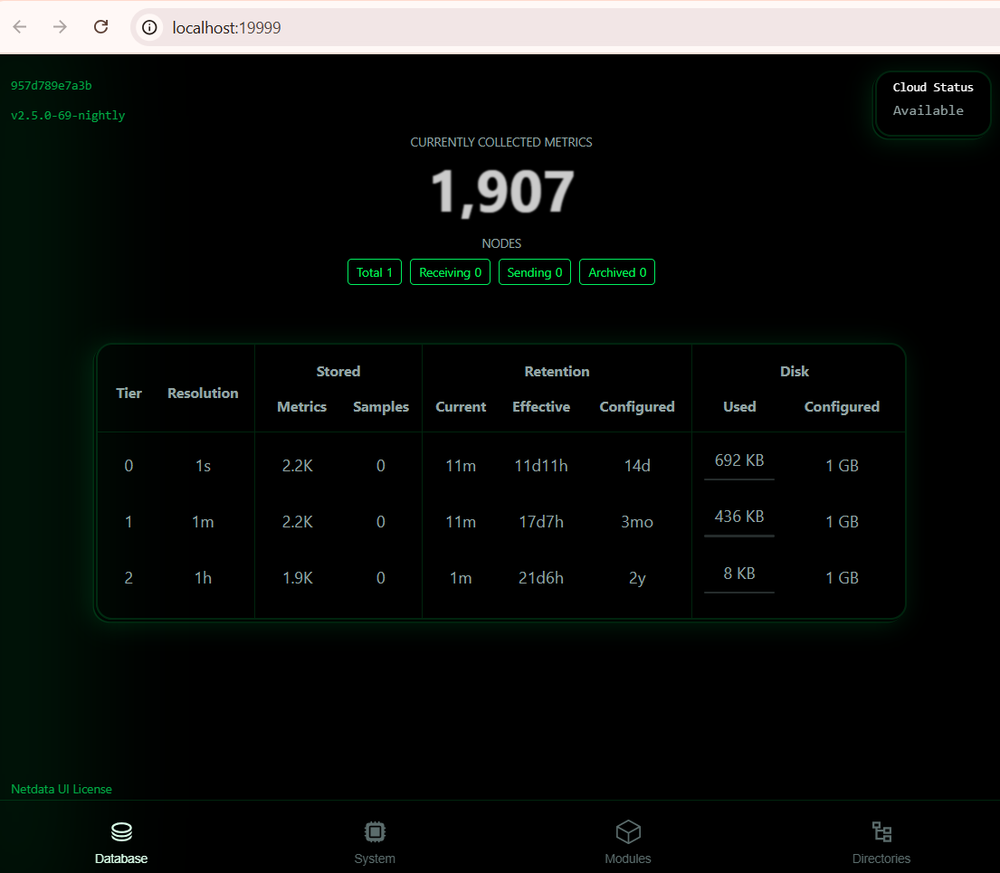
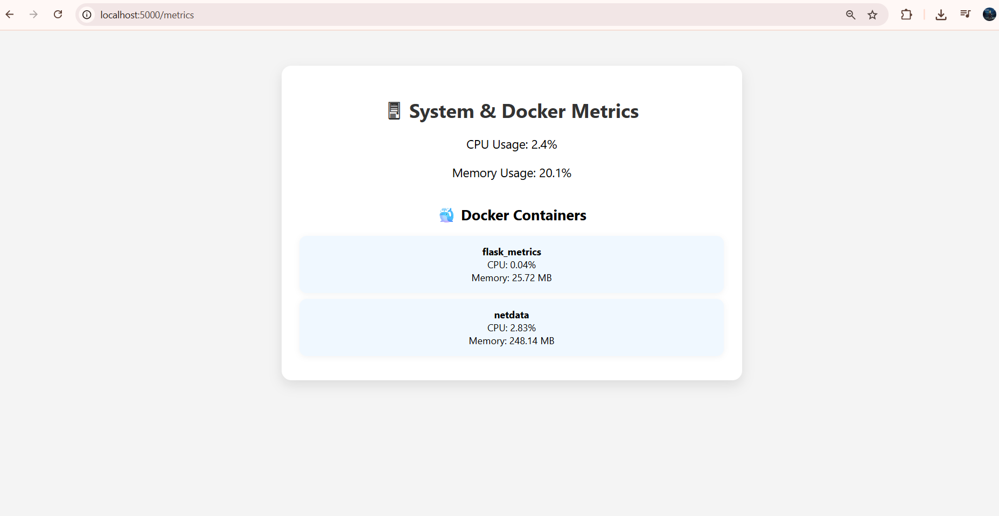

# System & App Monitoring with Netdata

This project demonstrates how to monitor system resources and a Flask app using **Netdata** in Docker.

## 🚀 Tools Used
- Netdata (for real-time monitoring)
- Docker & Docker Compose
- Flask (lightweight Python web app)

## 📊 Features
- Monitor system CPU, memory, disk
- Monitor running Docker containers
- Visualize metrics from Flask app
- Access logs and alerts via Netdata UI

## 📂 Project Structure
- `app.py: Simple Flask web app exposing metrics
- Dockerfile for flask
-  requirements.txt: shows requirements
- `docker-compose.yml`: Runs Flask and Netdata containers

## How to run simply type :
                      `docker-compose up --build`

                      
## Working of Project
 

